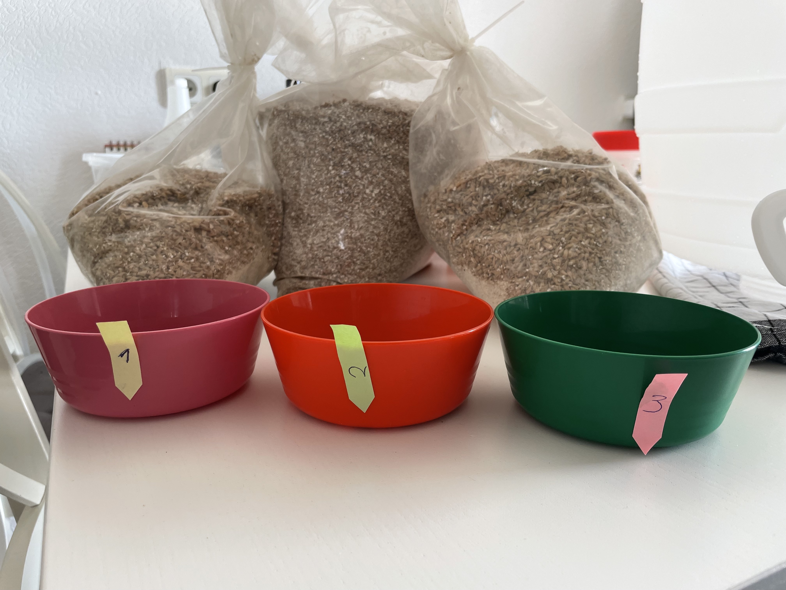
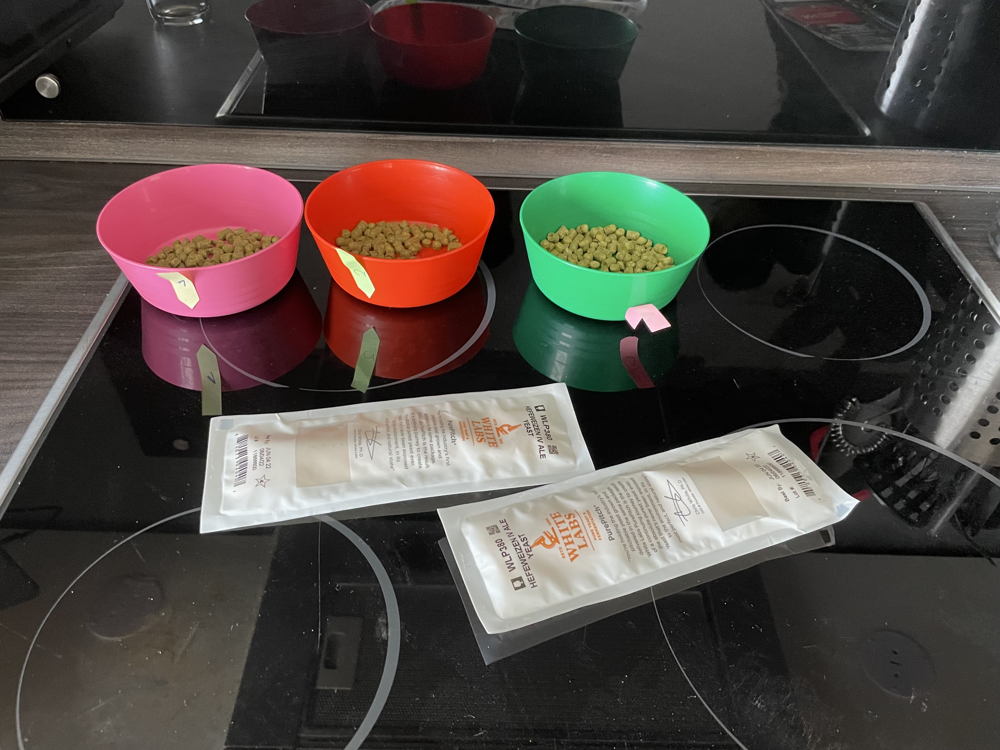
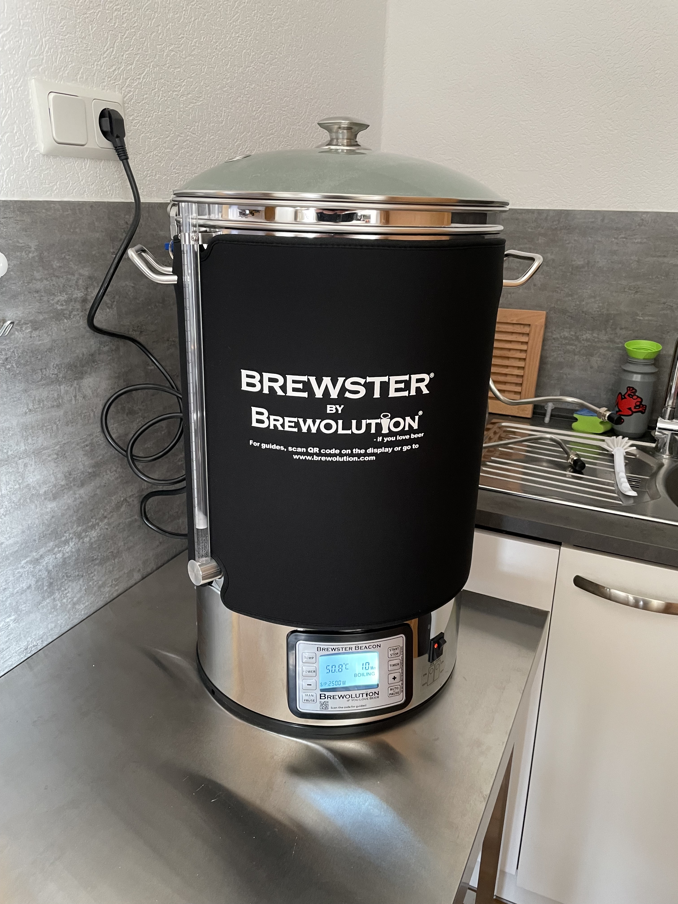
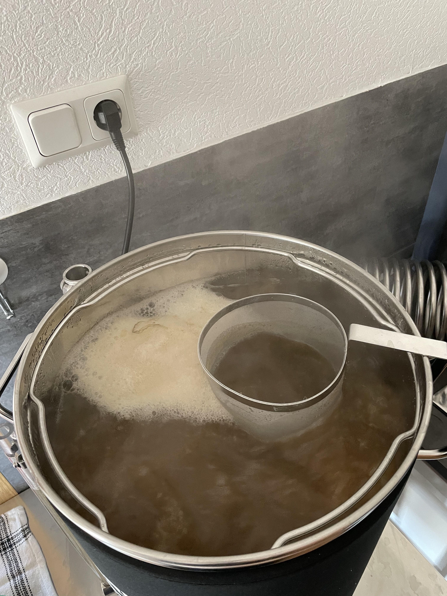

Heute habe ich meinen ersten Sud gemacht: 
[Triticum Wormatia](https://www.maischemalzundmehr.de/index.php?inhaltmitte=recipe&seite=2&id=257&factorhav=&factorhav2=&factorha1=&factorha2=&factorha3=&factorha4=&factorha5=&factorha6=&suche_klonrezepte=&suche_begriff=&suche_sorte=Weizen%2C+Hell&suche_malz=&suche_malz2=egal&suche_hopfen=&suche_hefe=&ordertype=DESC&factoraw=20&x=0&y=0&factorsha=60)
von [Maische Malz und Mehr](https://www.maischemalzundmehr.de/). Es lief alles gut, allerdings musste ich die 
Verzuckerungsrast zweimal um 20 Minuten auf insgesamt 60 Minuten verlängern, bis die Maische keine Stärke mehr enthalten 
hat. Der Grund hierfür liegt wohl am Klimawandel: Durch die warmen und trockenen Sommer scheint sich die Stärkestruktur
im Getreide geändert zu haben, weshalb man heutzutage bei 64°C einmaischen sollte (gilt für alle Rezepte). 
Das Rezept wurde vor zehn Jahren erstellt, damals gab es das Problem noch nicht in diesem Maße.

Im Whirlpool habe ich 4g mehr Saphir zugegeben, da mir herbere Biere besser schmecken. Nach dem Kochen hatte die Würze 
14.5°P; ich habe die Würze vor dem Anstellen mit 3L Wasser verdünnt, da ich bei 12.5°P - 13°P rauskommen wollte. 
Im Gegensatz zum Rezept habe ich mit einer WLP380 angestellt. 

