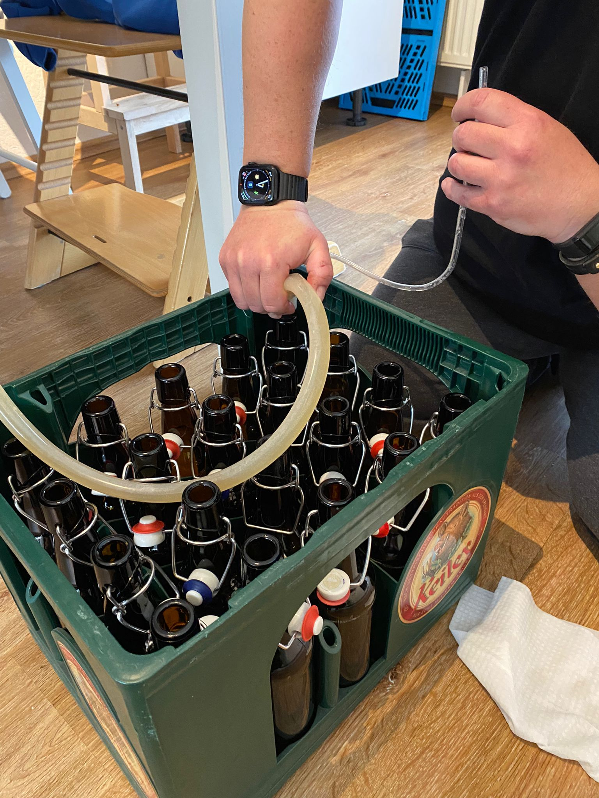
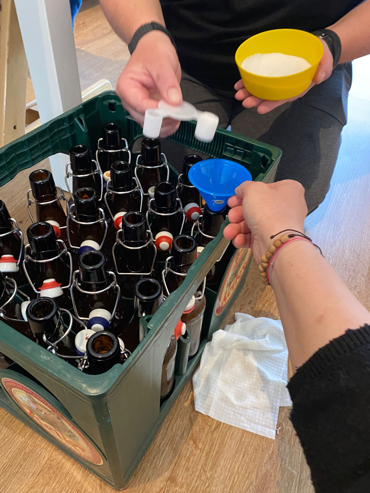
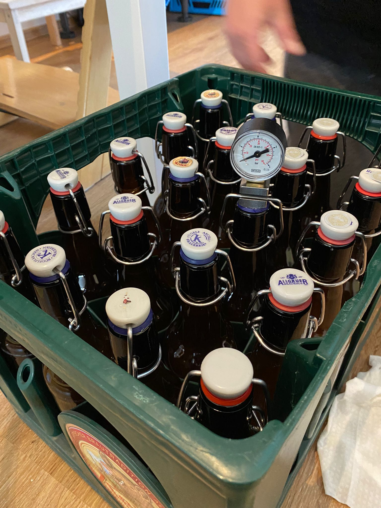

Heute habe ich mein erstes Jungbier abgefüllt, nachdem sich seit 4 Tagen der Restextrakt nicht mehr geändert hat. 
Ich war sehr aufgeregt, da ich mir nicht sicher war, ob es so funktioniert, wie ich es viele Male im Kopf durchgespielt habe.

Die Sorge war aber unbegründet - es hat alles super funktioniert! Mit der Bierpistole war es letztlich ein Kinderspiel, 
den richtigen Füllstand hinzubekommen. Um eine Karbonisierung von 6,5g/l zu erreichen, habe ich pro Flasche 4,75g 
Haushaltszucker hinzugefügt. Für die Berechnung habe ich den Rechner von 
[Verschiedene Berechnungen rund ums Selbstgebraute](http://fabier.de/biercalcs.html) benutzt.

